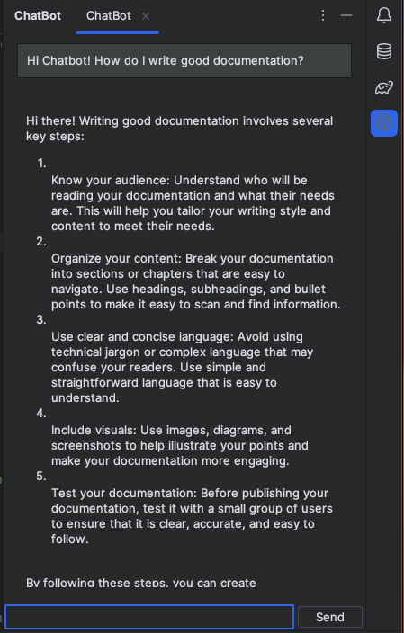
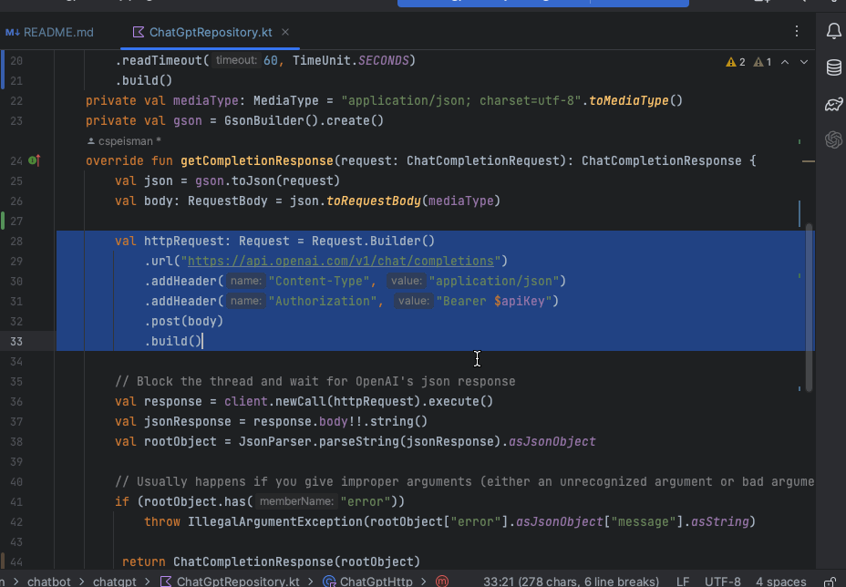
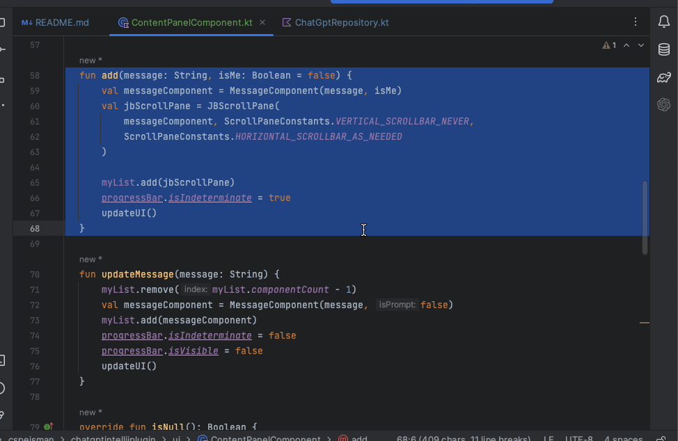
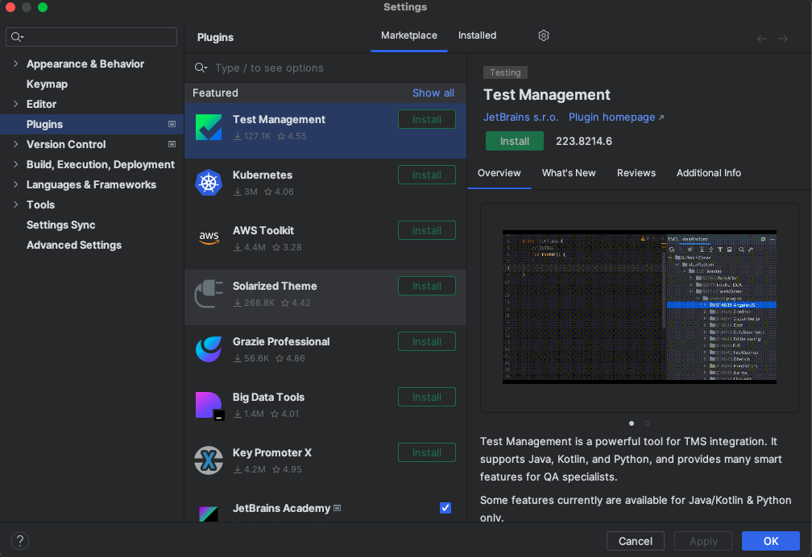
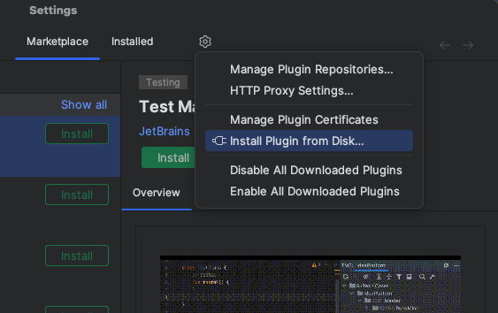
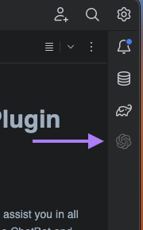

# QB's ChatBot Intellij Plugin

QB's ChatBot Intellij Plugin is a powerful tool that integrates ChatGPT into the IntelliJ IDE, providing developers with a seamless and efficient coding experience. With this plugin, you can harness the power of ChatGPT to assist you in various coding tasks, from explaining code snippets to refactoring code.

## Overview

The ChatBot plugin leverages the capabilities of ChatGPT, a state-of-the-art language model developed by OpenAI, to assist developers in their coding endeavors. Whether you're seeking explanations for complex code blocks, looking for suggestions to refactor existing code, or simply need a knowledgeable AI assistant to tackle general programming-related queries, this plugin has got you covered.

## Features

### General Questions

With QB's ChatBot Intellij Plugin, you can engage in open dialogue with the ChatGPT model directly within the IntelliJ IDE. Simply click on the ChatBot icon in the right-side toolbar to open the ChatBot panel, where you can type your queries and receive insightful responses.

### Code Explanation

Highlight a block of code within your project, and use the "Ask ChatBot to Explain" action to receive a detailed explanation of the selected code. The ChatGPT model will analyze the code and provide a comprehensive breakdown, making it easier for you to understand complex logic or unfamiliar code segments.

### Code Refactoring

If you're looking to improve the quality of your code, QB's ChatBot Intellij Plugin offers a convenient "Ask ChatBot to Refactor" action. Simply highlight the code you want to refactor, invoke the action, and the ChatGPT model will suggest an optimized version of the code. You can then use the "Replace Selection" button to seamlessly incorporate the suggested refactoring into your codebase.

### Test Case Genration 

QB's ChatBot Intellij Plugin can aid in the crucial task of writing test cases for your code. Highlight the code you want to test, and use the "Ask ChatBot to Generate Test Cases" action. The ChatGPT model will analyze the code and provide a set of relevant test cases, helping you ensure your code's correctness and maintainability.

## Installation

1. Download the plugin's zip file `coreys-chatgpt-intellij-plugin-0.0.1.zip` from the repository.
[qb-chatgpt-intellij-plugin-0.0.1.zip](coreys-chatgpt-intellij-plugin-0.0.1.zip)

2. In IntelliJ, navigate to the plugin panel in the settings modal (`File > Settings > Plugins`).
 

3. Click on the gear icon in the top-right corner, and select "Install Plugin from Disk..."
 

4. Browse and select the downloaded ZIP file to install the plugin.
5. After successful installation, you should see the ChatBot icon in the right-side toolbar, indicating that the plugin is ready for use.

 

## Setup

Before using QB's ChatBot Intellij Plugin, you'll need to configure your ChatGPT API key:

1. Navigate to the plugin settings page (`Tools > QB's ChatBot: ChatGPT Settings`).
2. Obtain your API key from the [OpenAI website](https://platform.openai.com/account/api-keys) and paste it into the provided field.
3. (Optional) If you prefer to use a specific ChatGPT model, you can specify it in the settings. Otherwise, the plugin will default to the `gpt-3.5-turbo` model.

## Contributing

We welcome contributions from the community to enhance QB's ChatBot Intellij Plugin. If you have any ideas, bug reports, or feature requests, please open an issue or submit a pull request on the [GitHub repository](https://github.com/your-repo/qbs-chatbot-intellij-plugin).

## License

QB's ChatBot Intellij Plugin is released under the [MIT License](LICENSE).

---

Plugin based on the [IntelliJ Platform Plugin Template](https://github.com/JetBrains/intellij-platform-plugin-template).
